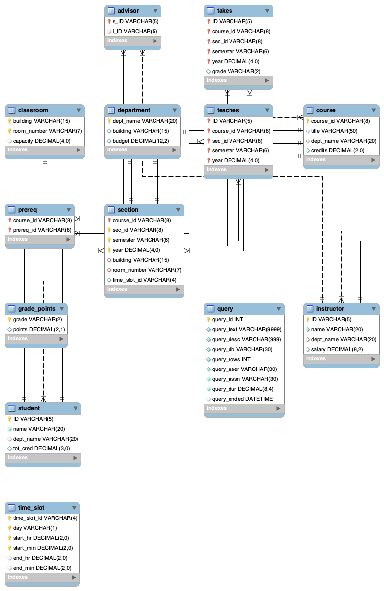
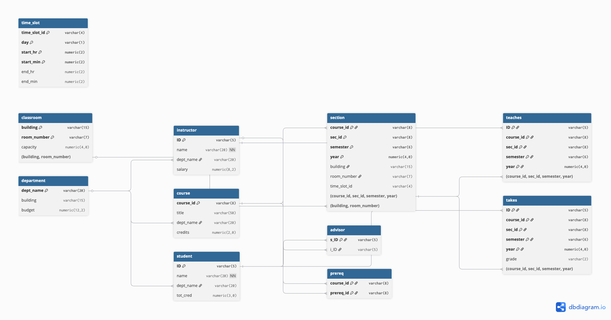

# Database Systems (CSCI 331) Winter 2026
## Assignment #8: Entity-Relationship Diagrams

**Name:** Zohaib Cheema  
**Date:** January 2026  
**Course:** CSCI 331 - Database Systems

---

## Section 1: Task [1] MySQL Workbench Reverse Engineer ERD

**Screenshot/Export of ERD from MySQL Workbench**



**Description:**

I used the Database → Reverse Engineer feature in MySQL Workbench to create the ERD. I selected Local instance and chose the university schema, then included all tables and excluded views. I enabled the "place objects on diagram" option so it would automatically arrange everything. The ERD shows 12 tables from the university database (advisor, takes, classroom, department, prereq, section, grade_points, student, time_slot, teaches, course, instructor) plus the query table from the meta database. It shows all the attributes, primary keys, and foreign key relationships using crow's foot notation.

---

## Section 2: Task [2] Second ER Tool ERD

**Screenshot/Export of ERD from Second Tool (dbdiagram.io)**



**Description:**

I created the ERD using dbdiagram.io. I imported the database schema and used the automatic layout feature to arrange the tables. The ERD shows 11 tables from the university database (time_slot, classroom, department, instructor, course, student, section, advisor, prereq, teaches, takes). It shows all the columns, data types, and relationships between tables. The relationships are shown as lines with arrows that connect foreign key columns to primary key columns.

---

## Section 3: Task [3] Comparison Table of 10 ERD Features

| Feature | What it means (lecture) | Workbench ERD evidence | Other ERD evidence |
|---------|------------------------|------------------------|-------------------|
| 1. Entities/tables as boxes | Tables are represented as rectangular boxes in the diagram | Each table appears as a rectangular box with a light blue background and table name in a darker blue header. 12 tables are shown: advisor, takes, classroom, department, prereq, section, grade_points, student, time_slot, teaches, course, instructor, and query (from meta database). | Tables are represented as rectangular boxes with blue headers containing the table name. 11 university tables are shown: time_slot, classroom, department, instructor, course, student, section, advisor, prereq, teaches, takes. Columns are listed below each table name. |
| 2. Primary key visibility | Primary keys are clearly marked/identified in the table representation | Primary keys are shown with a yellow key icon (↑) next to the column name. For example, student.ID, instructor.ID, course.course_id have the key icon. Composite PKs like section(course_id, sec_id, semester, year) show the key icon on all PK columns. Regular attributes marked with diamond icon (◇). | Primary keys are indicated by being part of the composite primary key notation shown at the bottom of each table box (e.g., "Primary Key: (course_id, sec_id, semester, year)"). Single-column PKs like ID, course_id, dept_name are clearly marked as Primary Key in the notation. |
| 3. Foreign key relationships drawn only when FK constraints exist | Relationship lines appear only between tables that have actual foreign key constraints in the database | Relationship lines connect tables that have FK constraints: student↔advisor↔instructor, takes↔student, takes↔section, takes↔grade_points (dashed line), section↔course, section↔classroom, teaches↔instructor, teaches↔section, prereq↔course (self-referential), course↔department, instructor↔department, student↔department. time_slot appears isolated with no relationship line to section, indicating section.time_slot_id doesn't have an FK constraint. | FK relationships shown as lines with arrows connecting foreign key columns to primary key columns. Relationships include: department referenced by instructor/course/student, classroom referenced by section, course referenced by section/prereq, instructor referenced by advisor/teaches, student referenced by advisor/takes, section referenced by teaches/takes. time_slot shows no relationship line to section. |
| 4. Cardinality display (1, many) | The diagram shows whether relationships are one-to-one, one-to-many, or many-to-many | Uses crow's foot notation: many side shows crow's foot (three pronged), one side shows single vertical bar. Examples: student(one) ↔ (many)takes, instructor(one) ↔ (many)teaches, course(one) ↔ (many)section, student(one) ↔ (one)advisor ↔ (one)instructor, department(one) ↔ (many)course/instructor/student. | Cardinality is shown through the direction of arrows and the relationship structure. One-to-many relationships are clear: department→instructor/course/student, instructor→teaches, student→takes, course→section, section→teaches/takes. One-to-one relationships shown for advisor linking student and instructor. |
| 5. Relationship notation style | The visual style used to represent relationships (crow's foot vs classic/diamond notation) | Uses crow's foot notation (Martin/Chen style). Relationship lines connect directly between tables with crow's feet on the many side and single bar on the one side. No diamond shapes are used. One relationship (takes to grade_points) uses a dashed line. | Uses line notation with arrows. Lines connect tables directly with arrows pointing from foreign key to primary key. No diamond shapes or crow's foot symbols, but relationship direction is clear from arrows. |
| 6. Optional vs mandatory participation | Indicates whether participation in a relationship is required (mandatory) or optional | The ERD shows relationship cardinality but does not explicitly show optional vs mandatory participation through circles or "0..1" notation. All relationships appear as solid lines connecting the tables (except takes→grade_points which uses a dashed line). | The tool shows foreign keys as part of the column definitions (marked as Foreign Key) but does not explicitly indicate optional vs mandatory participation through additional notation. All relationships appear as direct line connections. |
| 7. Composite primary keys | Shows when a primary key consists of multiple columns (e.g., section, takes, teaches tables) | Composite PKs clearly shown with key icon on each PK column: section has PK (course_id, sec_id, semester, year), takes has PK (ID, course_id, sec_id, semester, year), teaches has PK (ID, course_id, sec_id, semester, year), advisor has PK (s_ID) only, prereq has PK (course_id, prereq_id), classroom has PK (building, room_number), time_slot has PK (time_slot_id, day, start_hr, start_min). | Composite PKs displayed with notation at bottom of table: section Primary Key (course_id, sec_id, semester, year), takes Primary Key (ID, course_id, sec_id, semester, year), teaches Primary Key (ID, course_id, sec_id, semester, year), prereq Primary Key (course_id, prereq_id), classroom Primary Key (building, room_number). advisor shows only s_ID as Primary Key. |
| 8. Data types / attribute metadata shown in diagram | Column data types (VARCHAR, INT, etc.) and other metadata are visible in the table boxes | Each column shows data type: ID VARCHAR(5), name VARCHAR(20), dept_name VARCHAR(20), tot_cred DECIMAL(3,0), salary DECIMAL(8,2), credits DECIMAL(2,0), etc. NOT NULL constraints shown (e.g., instructor.name, student.name). Regular attributes marked with diamond icon (◇). | Data types shown for each column: ID varchar(5), name varchar(20) NN (Not Null), dept_name varchar(20), tot_cred numeric(3,0), salary numeric(8,2), credits numeric(2,0), etc. Column names, data types, and NOT NULL constraints (marked as NN) are visible. |
| 9. Layout/editability | Ability to drag and rearrange tables for better readability | Tables are arranged automatically by Workbench's layout algorithm. Tables can be manually repositioned by dragging, and relationship lines automatically adjust to maintain connections. The layout groups related tables together. | Tables are arranged in a logical flow from left to right and top to bottom (foundational tables like time_slot/classroom/department on left, relationship tables like advisor/prereq/teaches/takes on right). Layout appears automatically generated but can be customized. |
| 10. Missing relationship example | time_slot table is isolated because section.time_slot_id doesn't have an FK constraint | time_slot appears as an isolated table with no relationship lines connecting to section, even though section has a time_slot_id VARCHAR(4) column. This confirms there is no FOREIGN KEY constraint defined in the database from section.time_slot_id to time_slot.time_slot_id. | time_slot appears in the ERD and section shows time_slot_id as a varchar(4) column, but no relationship line connects section to time_slot. This indicates the foreign key constraint doesn't exist in the database schema, even though the column exists. |

---

## Section 4: Task [4] Forward-Engineered SQL and Comparison vs Original DDL

### Forward-Engineered SQL from MySQL Workbench

```sql
-- MySQL Workbench Forward Engineering

SET @OLD_UNIQUE_CHECKS=@@UNIQUE_CHECKS, UNIQUE_CHECKS=0;
SET @OLD_FOREIGN_KEY_CHECKS=@@FOREIGN_KEY_CHECKS, FOREIGN_KEY_CHECKS=0;
SET @OLD_SQL_MODE=@@SQL_MODE, SQL_MODE='ONLY_FULL_GROUP_BY,STRICT_TRANS_TABLES,NO_ZERO_IN_DATE,NO_ZERO_DATE,ERROR_FOR_DIVISION_BY_ZERO,NO_ENGINE_SUBSTITUTION';

-- -----------------------------------------------------
-- Schema mydb
-- -----------------------------------------------------
-- -----------------------------------------------------
-- Schema university
-- -----------------------------------------------------

-- -----------------------------------------------------
-- Schema university
-- -----------------------------------------------------
CREATE SCHEMA IF NOT EXISTS `university` DEFAULT CHARACTER SET utf8mb4 COLLATE utf8mb4_0900_ai_ci ;
USE `university` ;

-- -----------------------------------------------------
-- Table `university`.`department`
-- -----------------------------------------------------
CREATE TABLE IF NOT EXISTS `university`.`department` (
  `dept_name` VARCHAR(20) NOT NULL,
  `building` VARCHAR(15) NULL DEFAULT NULL,
  `budget` DECIMAL(12,2) NULL DEFAULT NULL,
  PRIMARY KEY (`dept_name`))
ENGINE = InnoDB
DEFAULT CHARACTER SET = utf8mb4
COLLATE = utf8mb4_0900_ai_ci;


-- -----------------------------------------------------
-- Table `university`.`instructor`
-- -----------------------------------------------------
CREATE TABLE IF NOT EXISTS `university`.`instructor` (
  `ID` VARCHAR(5) NOT NULL,
  `name` VARCHAR(20) NOT NULL,
  `dept_name` VARCHAR(20) NULL DEFAULT NULL,
  `salary` DECIMAL(8,2) NULL DEFAULT NULL,
  PRIMARY KEY (`ID`),
  INDEX `dept_name` (`dept_name` ASC) VISIBLE,
  CONSTRAINT `instructor_ibfk_1`
    FOREIGN KEY (`dept_name`)
    REFERENCES `university`.`department` (`dept_name`)
    ON DELETE SET NULL)
ENGINE = InnoDB
DEFAULT CHARACTER SET = utf8mb4
COLLATE = utf8mb4_0900_ai_ci;


-- -----------------------------------------------------
-- Table `university`.`student`
-- -----------------------------------------------------
CREATE TABLE IF NOT EXISTS `university`.`student` (
  `ID` VARCHAR(5) NOT NULL,
  `name` VARCHAR(20) NOT NULL,
  `dept_name` VARCHAR(20) NULL DEFAULT NULL,
  `tot_cred` DECIMAL(3,0) NULL DEFAULT NULL,
  PRIMARY KEY (`ID`),
  INDEX `dept_name` (`dept_name` ASC) VISIBLE,
  CONSTRAINT `student_ibfk_1`
    FOREIGN KEY (`dept_name`)
    REFERENCES `university`.`department` (`dept_name`)
    ON DELETE SET NULL)
ENGINE = InnoDB
DEFAULT CHARACTER SET = utf8mb4
COLLATE = utf8mb4_0900_ai_ci;


-- -----------------------------------------------------
-- Table `university`.`advisor`
-- -----------------------------------------------------
CREATE TABLE IF NOT EXISTS `university`.`advisor` (
  `s_ID` VARCHAR(5) NOT NULL,
  `i_ID` VARCHAR(5) NULL DEFAULT NULL,
  PRIMARY KEY (`s_ID`),
  INDEX `i_ID` (`i_ID` ASC) VISIBLE,
  CONSTRAINT `advisor_ibfk_1`
    FOREIGN KEY (`i_ID`)
    REFERENCES `university`.`instructor` (`ID`)
    ON DELETE SET NULL,
  CONSTRAINT `advisor_ibfk_2`
    FOREIGN KEY (`s_ID`)
    REFERENCES `university`.`student` (`ID`)
    ON DELETE CASCADE)
ENGINE = InnoDB
DEFAULT CHARACTER SET = utf8mb4
COLLATE = utf8mb4_0900_ai_ci;


-- -----------------------------------------------------
-- Table `university`.`classroom`
-- -----------------------------------------------------
CREATE TABLE IF NOT EXISTS `university`.`classroom` (
  `building` VARCHAR(15) NOT NULL,
  `room_number` VARCHAR(7) NOT NULL,
  `capacity` DECIMAL(4,0) NULL DEFAULT NULL,
  PRIMARY KEY (`building`, `room_number`))
ENGINE = InnoDB
DEFAULT CHARACTER SET = utf8mb4
COLLATE = utf8mb4_0900_ai_ci;


-- -----------------------------------------------------
-- Table `university`.`course`
-- -----------------------------------------------------
CREATE TABLE IF NOT EXISTS `university`.`course` (
  `course_id` VARCHAR(8) NOT NULL,
  `title` VARCHAR(50) NULL DEFAULT NULL,
  `dept_name` VARCHAR(20) NULL DEFAULT NULL,
  `credits` DECIMAL(2,0) NULL DEFAULT NULL,
  PRIMARY KEY (`course_id`),
  INDEX `dept_name` (`dept_name` ASC) VISIBLE,
  CONSTRAINT `course_ibfk_1`
    FOREIGN KEY (`dept_name`)
    REFERENCES `university`.`department` (`dept_name`)
    ON DELETE SET NULL)
ENGINE = InnoDB
DEFAULT CHARACTER SET = utf8mb4
COLLATE = utf8mb4_0900_ai_ci;


-- -----------------------------------------------------
-- Table `university`.`grade_points`
-- -----------------------------------------------------
CREATE TABLE IF NOT EXISTS `university`.`grade_points` (
  `grade` VARCHAR(2) NOT NULL,
  `points` DECIMAL(2,1) NULL DEFAULT NULL,
  PRIMARY KEY (`grade`))
ENGINE = InnoDB
DEFAULT CHARACTER SET = utf8mb4
COLLATE = utf8mb4_0900_ai_ci;


-- -----------------------------------------------------
-- Table `university`.`prereq`
-- -----------------------------------------------------
CREATE TABLE IF NOT EXISTS `university`.`prereq` (
  `course_id` VARCHAR(8) NOT NULL,
  `prereq_id` VARCHAR(8) NOT NULL,
  PRIMARY KEY (`course_id`, `prereq_id`),
  INDEX `prereq_id` (`prereq_id` ASC) VISIBLE,
  CONSTRAINT `prereq_ibfk_1`
    FOREIGN KEY (`course_id`)
    REFERENCES `university`.`course` (`course_id`)
    ON DELETE CASCADE,
  CONSTRAINT `prereq_ibfk_2`
    FOREIGN KEY (`prereq_id`)
    REFERENCES `university`.`course` (`course_id`))
ENGINE = InnoDB
DEFAULT CHARACTER SET = utf8mb4
COLLATE = utf8mb4_0900_ai_ci;


-- -----------------------------------------------------
-- Table `university`.`query`
-- -----------------------------------------------------
CREATE TABLE IF NOT EXISTS `university`.`query` (
  `query_id` INT NOT NULL AUTO_INCREMENT,
  `query_text` VARCHAR(9999) NOT NULL,
  `query_desc` VARCHAR(999) NOT NULL,
  `query_db` VARCHAR(30) NOT NULL,
  `query_rows` INT NOT NULL DEFAULT '0',
  `query_user` VARCHAR(30) NOT NULL,
  `query_assn` VARCHAR(30) NOT NULL,
  `query_dur` DECIMAL(8,4) NOT NULL,
  `query_ended` DATETIME NULL DEFAULT CURRENT_TIMESTAMP,
  PRIMARY KEY (`query_id`))
ENGINE = InnoDB
DEFAULT CHARACTER SET = utf8mb4
COLLATE = utf8mb4_0900_ai_ci;


-- -----------------------------------------------------
-- Table `university`.`section`
-- -----------------------------------------------------
CREATE TABLE IF NOT EXISTS `university`.`section` (
  `course_id` VARCHAR(8) NOT NULL,
  `sec_id` VARCHAR(8) NOT NULL,
  `semester` VARCHAR(6) NOT NULL,
  `year` DECIMAL(4,0) NOT NULL,
  `building` VARCHAR(15) NULL DEFAULT NULL,
  `room_number` VARCHAR(7) NULL DEFAULT NULL,
  `time_slot_id` VARCHAR(4) NULL DEFAULT NULL,
  PRIMARY KEY (`course_id`, `sec_id`, `semester`, `year`),
  INDEX `building` (`building` ASC, `room_number` ASC) VISIBLE,
  CONSTRAINT `section_ibfk_1`
    FOREIGN KEY (`course_id`)
    REFERENCES `university`.`course` (`course_id`)
    ON DELETE CASCADE,
  CONSTRAINT `section_ibfk_2`
    FOREIGN KEY (`building` , `room_number`)
    REFERENCES `university`.`classroom` (`building` , `room_number`)
    ON DELETE SET NULL)
ENGINE = InnoDB
DEFAULT CHARACTER SET = utf8mb4
COLLATE = utf8mb4_0900_ai_ci;


-- -----------------------------------------------------
-- Table `university`.`takes`
-- -----------------------------------------------------
CREATE TABLE IF NOT EXISTS `university`.`takes` (
  `ID` VARCHAR(5) NOT NULL,
  `course_id` VARCHAR(8) NOT NULL,
  `sec_id` VARCHAR(8) NOT NULL,
  `semester` VARCHAR(6) NOT NULL,
  `year` DECIMAL(4,0) NOT NULL,
  `grade` VARCHAR(2) NULL DEFAULT NULL,
  PRIMARY KEY (`ID`, `course_id`, `sec_id`, `semester`, `year`),
  INDEX `course_id` (`course_id` ASC, `sec_id` ASC, `semester` ASC, `year` ASC) VISIBLE,
  CONSTRAINT `takes_ibfk_1`
    FOREIGN KEY (`course_id` , `sec_id` , `semester` , `year`)
    REFERENCES `university`.`section` (`course_id` , `sec_id` , `semester` , `year`)
    ON DELETE CASCADE,
  CONSTRAINT `takes_ibfk_2`
    FOREIGN KEY (`ID`)
    REFERENCES `university`.`student` (`ID`)
    ON DELETE CASCADE)
ENGINE = InnoDB
DEFAULT CHARACTER SET = utf8mb4
COLLATE = utf8mb4_0900_ai_ci;


-- -----------------------------------------------------
-- Table `university`.`teaches`
-- -----------------------------------------------------
CREATE TABLE IF NOT EXISTS `university`.`teaches` (
  `ID` VARCHAR(5) NOT NULL,
  `course_id` VARCHAR(8) NOT NULL,
  `sec_id` VARCHAR(8) NOT NULL,
  `semester` VARCHAR(6) NOT NULL,
  `year` DECIMAL(4,0) NOT NULL,
  PRIMARY KEY (`ID`, `course_id`, `sec_id`, `semester`, `year`),
  INDEX `course_id` (`course_id` ASC, `sec_id` ASC, `semester` ASC, `year` ASC) VISIBLE,
  CONSTRAINT `teaches_ibfk_1`
    FOREIGN KEY (`course_id` , `sec_id` , `semester` , `year`)
    REFERENCES `university`.`section` (`course_id` , `sec_id` , `semester` , `year`)
    ON DELETE CASCADE,
  CONSTRAINT `teaches_ibfk_2`
    FOREIGN KEY (`ID`)
    REFERENCES `university`.`instructor` (`ID`)
    ON DELETE CASCADE)
ENGINE = InnoDB
DEFAULT CHARACTER SET = utf8mb4
COLLATE = utf8mb4_0900_ai_ci;


-- -----------------------------------------------------
-- Table `university`.`time_slot`
-- -----------------------------------------------------
CREATE TABLE IF NOT EXISTS `university`.`time_slot` (
  `time_slot_id` VARCHAR(4) NOT NULL,
  `day` VARCHAR(1) NOT NULL,
  `start_hr` DECIMAL(2,0) NOT NULL,
  `start_min` DECIMAL(2,0) NOT NULL,
  `end_hr` DECIMAL(2,0) NULL DEFAULT NULL,
  `end_min` DECIMAL(2,0) NULL DEFAULT NULL,
  PRIMARY KEY (`time_slot_id`, `day`, `start_hr`, `start_min`))
ENGINE = InnoDB
DEFAULT CHARACTER SET = utf8mb4
COLLATE = utf8mb4_0900_ai_ci;


SET SQL_MODE=@OLD_SQL_MODE;
SET FOREIGN_KEY_CHECKS=@OLD_FOREIGN_KEY_CHECKS;
SET UNIQUE_CHECKS=@OLD_UNIQUE_CHECKS;
```

---

### Original Day-1 DDL Script

```sql
create table classroom
	(building		varchar(15),
	 room_number		varchar(7),
	 capacity		numeric(4,0),
	 primary key (building, room_number)
	);

create table department
	(dept_name		varchar(20), 
	 building		varchar(15), 
	 budget		        numeric(12,2) check (budget > 0),
	 primary key (dept_name)
	);

create table course
	(course_id		varchar(8), 
	 title			varchar(50), 
	 dept_name		varchar(20),
	 credits		numeric(2,0) check (credits > 0),
	 primary key (course_id),
	 foreign key (dept_name) references department (dept_name)
		on delete set null
	);

create table instructor
	(ID			varchar(5), 
	 name			varchar(20) not null, 
	 dept_name		varchar(20), 
	 salary			numeric(8,2) check (salary > 29000),
	 primary key (ID),
	 foreign key (dept_name) references department (dept_name)
		on delete set null
	);

create table section
	(course_id		varchar(8), 
         sec_id			varchar(8),
	 semester		varchar(6)
		check (semester in ('Fall', 'Winter', 'Spring', 'Summer')), 
	 year			numeric(4,0) check (year > 1701 and year < 2100), 
	 building		varchar(15),
	 room_number		varchar(7),
	 time_slot_id		varchar(4),
	 primary key (course_id, sec_id, semester, year),
	 foreign key (course_id) references course (course_id)
		on delete cascade,
	 foreign key (building, room_number) references classroom (building, room_number)
		on delete set null
	);

create table teaches
	(ID			varchar(5), 
	 course_id		varchar(8),
	 sec_id			varchar(8), 
	 semester		varchar(6),
	 year			numeric(4,0),
	 primary key (ID, course_id, sec_id, semester, year),
	 foreign key (course_id, sec_id, semester, year) references section (course_id, sec_id, semester, year)
		on delete cascade,
	 foreign key (ID) references instructor (ID)
		on delete cascade
	);

create table student
	(ID			varchar(5), 
	 name			varchar(20) not null, 
	 dept_name		varchar(20), 
	 tot_cred		numeric(3,0) check (tot_cred >= 0),
	 primary key (ID),
	 foreign key (dept_name) references department (dept_name)
		on delete set null
	);

create table takes
	(ID			varchar(5), 
	 course_id		varchar(8),
	 sec_id			varchar(8), 
	 semester		varchar(6),
	 year			numeric(4,0),
	 grade		        varchar(2),
	 primary key (ID, course_id, sec_id, semester, year),
	 foreign key (course_id, sec_id, semester, year) references section (course_id, sec_id, semester, year)
		on delete cascade,
	 foreign key (ID) references student (ID)
		on delete cascade
	);

create table advisor
	(s_ID			varchar(5),
	 i_ID			varchar(5),
	 primary key (s_ID),
	 foreign key (i_ID) references instructor (ID)
		on delete set null,
	 foreign key (s_ID) references student (ID)
		on delete cascade
	);

create table time_slot
	(time_slot_id		varchar(4),
	 day			varchar(1),
	 start_hr		numeric(2) check (start_hr >= 0 and start_hr < 24),
	 start_min		numeric(2) check (start_min >= 0 and start_min < 60),
	 end_hr			numeric(2) check (end_hr >= 0 and end_hr < 24),
	 end_min		numeric(2) check (end_min >= 0 and end_min < 60),
	 primary key (time_slot_id, day, start_hr, start_min)
	);

create table prereq
	(course_id		varchar(8), 
	 prereq_id		varchar(8),
	 primary key (course_id, prereq_id),
	 foreign key (course_id) references course (course_id)
		on delete cascade,
	 foreign key (prereq_id) references course (course_id)
	);
```

---

### Comparison Analysis: Forward-Engineered SQL vs Original Day-1 DDL

**System Variables:**
- **Original DDL:** Doesn't have any SET statements at the beginning.
- **Forward-Engineered:** Workbench adds SET statements at the start like `SET @OLD_UNIQUE_CHECKS=@@UNIQUE_CHECKS, UNIQUE_CHECKS=0;` and similar ones for foreign keys and SQL mode. These turn off checks temporarily so tables can be created faster, then it restores them at the end.
- **Difference:** The forward-engineered SQL manages system variables explicitly, while the original DDL just uses MySQL's default settings.

**Character Set and Collation:**
- **Original DDL:** Doesn't specify character set or collation - just uses whatever MySQL's default is.
- **Forward-Engineered:** Specifically sets `utf8mb4` character set and `utf8mb4_0900_ai_ci` collation at both the schema level and table level.
- **Difference:** Forward-engineered SQL is more specific about character encoding. The original DDL just uses whatever the server default was.

**Storage Engine:**
- **Original DDL:** Doesn't specify the engine - uses whatever MySQL's default was.
- **Forward-Engineered:** Explicitly says `ENGINE = InnoDB` for every table.
- **Difference:** Forward-engineered SQL is more specific about which storage engine to use.

**Data Types:**
- **Original DDL:** Uses `numeric` for numbers like `numeric(4,0)`, `numeric(12,2)`, etc.
- **Forward-Engineered:** Changes all the `numeric` types to `DECIMAL` instead, like `DECIMAL(12,2)`, `DECIMAL(8,2)`, etc. Also uses `INT` for query.query_id and `DATETIME` for query.query_ended.
- **Difference:** Forward-engineered SQL uses `DECIMAL` instead of `NUMERIC`, but they're basically the same thing in MySQL. The original uses the SQL standard `NUMERIC` type.

**Indexes:**
- **Original DDL:** No explicit index statements - MySQL just creates them automatically for primary keys and foreign keys.
- **Forward-Engineered:** Has explicit INDEX statements using the column name, like `INDEX `dept_name``. Also includes the `VISIBLE` keyword which is a MySQL 8.0+ feature.
- **Difference:** Forward-engineered SQL explicitly states which indexes to create, while original DDL lets MySQL handle it automatically.

**Foreign Key Constraints and ON DELETE Behaviors:**
- **Original DDL:** Uses `ON DELETE SET NULL` for department references and `ON DELETE CASCADE` for section references. No ON DELETE clause for prereq.prereq_id. No ON UPDATE clauses.
- **Forward-Engineered:** Keeps the same ON DELETE behaviors as the original - SET NULL for departments and CASCADE for sections. No ON UPDATE clauses either.
- **Difference:** They're basically the same. Both use the same ON DELETE behaviors.

**CHECK Constraints:**
- **Original DDL:** Has lots of CHECK constraints like `check (budget > 0)`, `check (credits > 0)`, `check (salary > 29000)`, etc. for validation.
- **Forward-Engineered:** Doesn't have any CHECK constraints at all. They're all missing.
- **Difference:** Big difference here. The original has all these validation checks, but the forward-engineered SQL doesn't include them. I think Workbench doesn't capture CHECK constraints when it reverse engineers the database.

**Naming Conventions:**
- **Original DDL:** No explicit constraint names - MySQL generates them automatically. Uses lowercase names and no backticks.
- **Forward-Engineered:** Uses MySQL's standard naming like `instructor_ibfk_1`, `student_ibfk_1`, etc. for foreign keys. Uses backticks around all identifiers.
- **Difference:** Forward-engineered SQL explicitly shows the constraint names (which MySQL would generate anyway), and uses backticks everywhere. Original DDL doesn't specify constraint names.

**Composite Primary Keys:**
- **Original DDL:** Composite PKs written as `primary key (col1, col2, col3, col4)` with lowercase and spread across multiple lines.
- **Forward-Engineered:** Same idea but formatted as `PRIMARY KEY (`col1`, `col2`, `col3`, `col4`)` with uppercase and backticks, usually on one line.
- **Difference:** Same concept, just different formatting - forward-engineered uses uppercase and backticks.

**CREATE SCHEMA/DATABASE:**
- **Original DDL:** Doesn't create the database - assumes it already exists.
- **Forward-Engineered:** Includes `CREATE SCHEMA IF NOT EXISTS` with character set and collation, plus a `USE` statement.
- **Difference:** Forward-engineered SQL creates the database if it doesn't exist, original DDL assumes it's already there.

**IF NOT EXISTS Clause:**
- **Original DDL:** Just says `CREATE TABLE` - no `IF NOT EXISTS`. You'd need to drop tables first before running it again.
- **Forward-Engineered:** Uses `CREATE TABLE IF NOT EXISTS` everywhere, so you can run it multiple times safely.
- **Difference:** Forward-engineered SQL is safer to re-run, original would fail if tables already exist.

**Transaction/COMMIT Behavior:**
- **Original DDL:** No transaction statements - each CREATE TABLE commits separately.
- **Forward-Engineered:** May wrap everything in a transaction so all tables get created together, or it might commit separately.
- **Difference:** Forward-engineered might group things in a transaction, original doesn't.

**Quoting and Backticks:**
- **Original DDL:** No backticks, all lowercase keywords like `create table student`.
- **Forward-Engineered:** Uses backticks around everything like `` `university`.`student` `` and uppercase keywords like `CREATE TABLE`.
- **Difference:** Forward-engineered is more defensive with backticks and uses uppercase, original is simpler with lowercase and no backticks.

**NULL/NOT NULL Constraints:**
- **Original DDL:** Only says `NOT NULL` for instructor.name and student.name. Everything else defaults to allowing NULL.
- **Forward-Engineered:** Explicitly says `NOT NULL` or `NULL DEFAULT NULL` for every column based on how the database actually is right now.
- **Difference:** Forward-engineered is more explicit about what can be NULL, original mostly relies on defaults.

---

